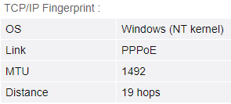
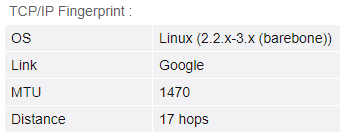
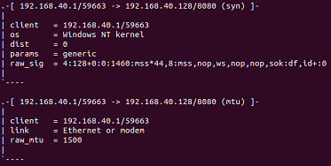
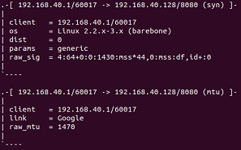

<h1 align="center">Documentation</h1>

* [Database configuration](#database-configuration)
* [Fingerprinting](#fingerprinting)
* [Impersonation](#impersonation)
* [Real world examples](#real-world-examples)
    * [Sniff connection attempts](#sniff-connection-attempts)
    * [Block connections by certain OS fingerprint](#block-connections-by-certain-os-fingerprint)
    * [Spoof p0f with impersonation](#spoof-p0f-with-impersonation)
* [Performance benchmarks](#performance-benchmarks)

## Database Configuration
Before using `pyp0f`, make sure to load the p0f signatures database.

By default, the included (p0f v3.09b) database will be loaded. However, you can specify a custom database path to parse.

```python
from pyp0f.database import DATABASE

DATABASE.load()  # or DATABASE.load("custom/database/file/p0f.fp")
```

## Fingerprinting
`pyp0f` accepts SYN, SYN+ACK and HTTP packets. Invalid packets raise `pyp0f.exceptions.PacketError`.

`pyp0f` makes sure to copy the packet before using it, to not modify the original accidentally.

Each fingerprint function returns a custom result instance which includes some informative fields that are typed appropriately.

<details markdown="1">
<summary>MTU fingerprinting example</summary>

```python
from scapy.layers.inet import IP, TCP
from pyp0f.fingerprint import fingerprint_mtu
from pyp0f.fingerprint.results import MTUResult

google_packet = IP() / TCP(options=[("MSS", 1430)])
result: MTUResult = fingerprint_mtu(google_packet)
print(result.packet_signature)  # MTUPacketSignature(mtu=1470)
print(result.match)
# MTURecord(
#     label=MTULabel(name="Google"),
#     signature=MTUSignature(mtu=1470),
#     raw_signature="1470",
#     line_number=67,
# )
```

</details>

<details markdown="1">
<summary>TCP fingerprinting example</summary>

```python
from scapy.layers.inet import IP, TCP
from pyp0f.fingerprint import fingerprint_tcp
from pyp0f.fingerprint.results import TCPResult

linux_packet = IP(tos=0x10, flags=0x02, ttl=58) / TCP(
    seq=1,
    window=29200,
    options=[("MSS", 1460), ("SAckOK", b""), ("Timestamp", (177816630, 0)), ("NOP", None), ("WScale", 7)],
)
result: TCPResult = fingerprint_tcp(linux_packet)
print(result.distance)  # 6
print(result.match)
# TCPMatch(
#     type=<TCPMatchType.EXACT: 1>,
#     record=TCPRecord(
#         label=Label(name='Linux', is_generic=False, os_class='unix', flavor='3.11 and newer', sys=()),
#         signature=TCPSignature(
#             ip_version=-1,
#             ip_options_length=0,
#             ttl=64,
#             is_bad_ttl=False,
#             window=WindowSignature(type=<WindowType.MSS: 4>, size=20, scale=7),
#             options=OptionsSignature(
#                 layout=[<TCPOption.MSS: 2>, <TCPOption.SACKOK: 4>, <TCPOption.TS: 8>, <TCPOption.NOP: 1>, <TCPOption.WS: 3>],
#                 mss=-1,
#                 eol_padding_length=0
#             ),
#             payload_class=0,
#             quirks=<Quirk.NZ_ID|DF: 6>
#         ),
#         raw_signature='*:64:0:*:mss*20,7:mss,sok,ts,nop,ws:df,id+:0',
#         line_number=97
#     )
# )
```

</details>

<details markdown="1">
<summary>HTTP fingerprinting example</summary>

```python
from pyp0f.fingerprint import fingerprint_http
from pyp0f.fingerprint.results import HTTPResult

apache_payload = b"HTTP/1.1 200 OK\r\nDate: Fri, 10 Jun 2011 13:27:01 GMT\r\nServer: Apache\r\nLast-Modified: Thu, 09 Jun 2011 17:25:43 GMT\r\nExpires: Mon, 13 Jun 2011 17:25:43 GMT\r\nETag: 963D6BC0ED128283945AF1FB57899C9F3ABF50B3\r\nCache-Control: max-age=272921,public,no-transform,must-revalidate\r\nContent-Length: 491\r\nConnection: close\r\nContent-Type: application/ocsp-response\r\n\r\n"
result: HTTPResult = fingerprint_http(apache_payload)
print(result.dishonest)  # False
print(result.match)
# HTTPRecord(
#     label=Label(
#         name="Apache",
#         is_generic=False,
#         os_class="!",
#         flavor="2.x",
#         sys=("@unix", "Windows"),
#     ),
#     signature=HTTPSignature(
#         version=1,
#         headers=[
#             SignatureHeader(
#                 name=b"Date", lower_name=b"date", is_optional=False, value=None
#             ),
#             SignatureHeader(
#                 name=b"Server", lower_name=b"server", is_optional=False, value=None
#             ),
#             ...
#         ],
#         expected_software=b"Apache",
#         absent_headers={b"keep-alive"},
#         ...
#     ),
#     raw_signature="1:Date,Server,?Last-Modified,?Accept-Ranges=[bytes],?Content-Length,?Connection=[close],?Transfer-Encoding=[chunked],Content-Type:Keep-Alive:Apache",
#     line_number=883,
# )
```

</details>

</details>

<details markdown="1">
<summary>TCP uptime fingerprinting example</summary>

```python
from scapy.layers.inet import IP, TCP
from pyp0f.net.packet import parse_packet
from pyp0f.net.signatures import TCPPacketSignature
from pyp0f.fingerprint.uptime import fingerprint_uptime
from pyp0f.utils.time import get_unix_time_ms

last_timestamp = IP() / TCP(seq=1, options=[("Timestamp", (1545573, 0))])
current_timestamp = IP() / TCP(seq=2, options=[("Timestamp", (1545586, 0))])

last_packet_signature = TCPPacketSignature.from_packet(parse_packet(last_timestamp))

# Simulate different receive time
last_packet_signature.received = get_unix_time_ms() - 130

result = fingerprint_uptime(current_timestamp, last_packet_signature)
print(result.tps)  # 100
print(result.uptime)
# Uptime(
#     raw_frequency=107.6923076923077,
#     frequency=100,
#     total_minutes=257,
#     modulo_days=497
# )
```

</details>

## Impersonation
`pyp0f` provides functionality to modify Scapy packets so that `p0f` will think it has been sent by a specific OS.

Each impersonation method must be provided with a record label or signature to impersonate.

<details markdown="1">
<summary>MTU impersonation example</summary>

```python
from scapy.layers.inet import IP, TCP
from pyp0f.impersonate import impersonate_mtu
from pyp0f.fingerprint import fingerprint_mtu

impersonated_packet = impersonate_mtu(
    IP() / TCP(),
    raw_label="generic tunnel or VPN",  # impersonate using a label
    raw_signature="1300",  # or using a signature
)
result = fingerprint_mtu(impersonated_packet)  # MTUResult for "generic tunnel or VPN"
```

</details>


<details markdown="1">
<summary>TCP impersonation example</summary>

```python
from scapy.layers.inet import IP, TCP
from pyp0f.impersonate import impersonate_tcp
from pyp0f.fingerprint import fingerprint_tcp

impersonated_packet = impersonate_tcp(
    IP() / TCP(),
    raw_label="s:unix:OpenVMS:7.x",  # impersonate using a label
    raw_signature="4:64:0:1460:61440,0:mss,nop,ws::0",  # or using a signature
)
result = fingerprint_tcp(impersonated_packet)  # TCPResult for "s:unix:OpenVMS:7.x"
```

</details>

## Real World Examples
`pyp0f` can be used in real world scenarios, whether its to passively fingerprint remote hosts,
or to deceive remote `p0f`.

### Sniff connection attempts
Using `scapy` to sniff incoming packets, we passively fingerprint remote hosts attempting to connect to our HTTP server.

See example [source code](../examples/fingerprint/scapy-sniff.py)

### Block connections by certain OS fingerprint
With `pyp0f.fingerprint` we can block certain OS users attempting to connect to our HTTP server (in this example - Windows).

We use `pydivert` to capture incoming packets before they enter the network stack, fingerprint them, and drop every connection attempt to our server from Windows hosts.

See example [source code](../examples/fingerprint/block-os.py)

### Spoof p0f with impersonation
With `pyp0f.impersonate` we can spoof running p0f by impersonating a certain OS.

In this case, I used Windows 10 with Ethernet, and impersonated Linux 2.2.x-3.x (barebone) with Google MTU.

[Browser leaks (TCP/IP Fingerprint section)](https://browserleaks.com/ip) (Before on left, after on right):
<div align="center">
    
    
</div>

Local Ubuntu VM running p0f (Before on left, after on right):
<div align="center">
    
    
</div>

We use `pydivert`/`netfilterqueue` to capture packets before they leave the network stack, create a new packet that impersonates an OS, and finally re-inject the impersonated packet back to the network stack to spoof p0f on the other end.

See Linux example [source code](../examples/impersonate/spoof-p0f-linux.py)

See Windows example [source code](../examples/impersonate/spoof-p0f-windows.py)

## Performance benchmarks
`pyp0f` includes a file to benchmark the main methods it provides - fingerprint, impersonate.
The latest results were ran using an i5 7th gen.

```console
Performance benchmark: Load Database
Ran 1000 iterations in 9.76s
Average time for one iteration of Load Database: 9ms
-----------------------------------
Performance benchmark: MTU Fingerprint (25 Packets)
Ran 1000 iterations in 19.808s
Average time for one iteration of MTU Fingerprint (25 Packets): 19ms
-----------------------------------
Performance benchmark: TCP Fingerprint (153 Packets)
Ran 1000 iterations in 227.91s
Average time for one iteration of TCP Fingerprint (153 Packets): 227ms
-----------------------------------
Performance benchmark: HTTP Fingerprint (3 Packets)
Ran 1000 iterations in 0.15791s
Average time for one iteration of HTTP Fingerprint (3 Packets): 0ms
-----------------------------------
Performance benchmark: MTU Impersonation (25 Signatures)
Ran 1000 iterations in 4.5696s
Average time for one iteration of MTU Impersonation (25 Signatures): 4ms
-----------------------------------
Performance benchmark: TCP Impersonation (153 Signatures)
Ran 1000 iterations in 103.97s
Average time for one iteration of TCP Impersonation (153 Signatures): 103ms
```

See benchmark [source code](../scripts/benchmark.py)
